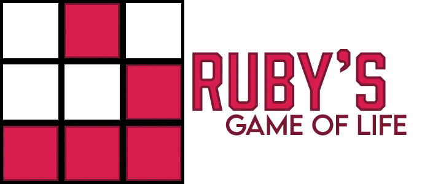

[](https://ko-fi.com/ualacecafe)

## What's Ruby's Life

Ruby's Life is a recreation of the well-known cellular automaton [_Conway's Game of Life_](https://en.wikipedia.org/wiki/Conway%27s_Game_of_Life) written in Ruby using the [Ruby2D gem](https://github.com/ruby2d/ruby2d).

## How to Play

```ruby life.rb```

| Control           | Description                                                                 |
|:------------------|:----------------------------------------------------------------------------|
| Left Mouse Button | Draws a cell                                                                |
| P                 | Pauses the game                                                             |
| R                 | Resets the grid to the previous state (i.e. before the last cell was drawn) |
| C                 | Clears the screen                                                           |                                                            
| ESC               | Exit the game                                                               |

## Credits

* John Horton Conway for coming up with the Game of Life;
* [Ruby2D's](https://github.com/ruby2d/ruby2d) developers for creating this amazing gem.
* [Daniel Shiffman](https://www.youtube.com/channel/UCvjgXvBlbQiydffZU7m1_aw) for the inspiration.